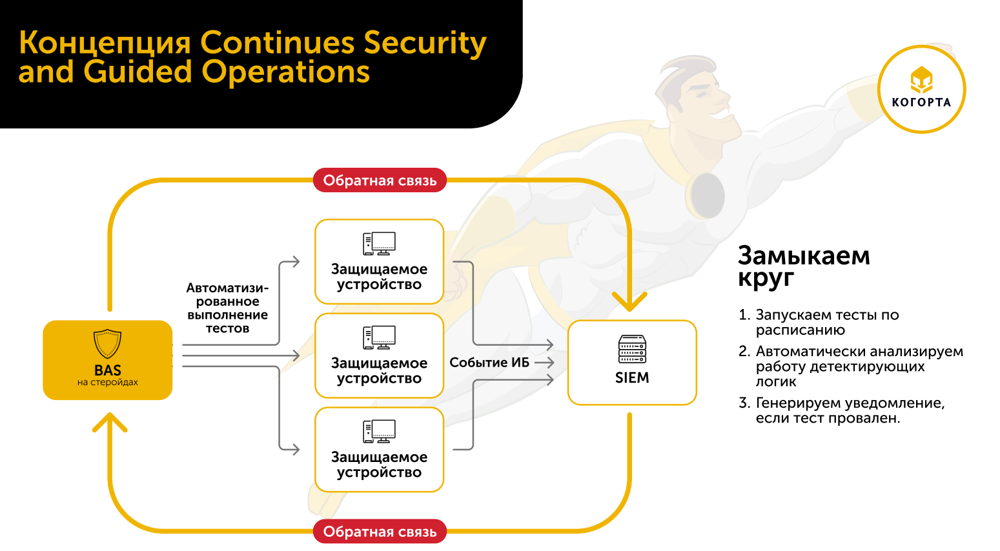
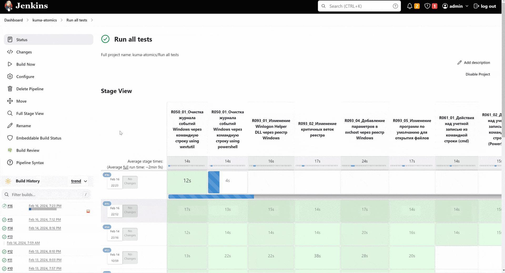
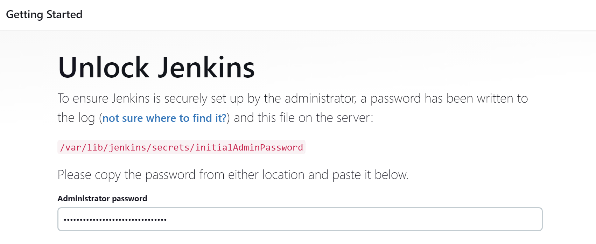
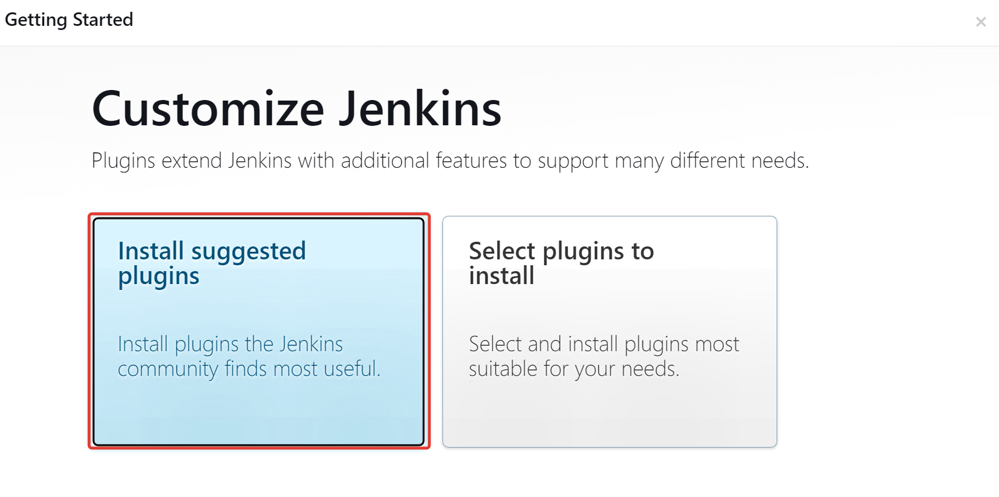
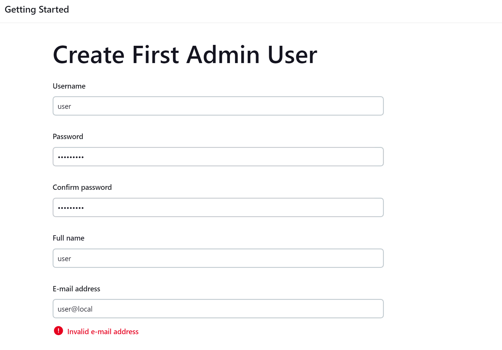
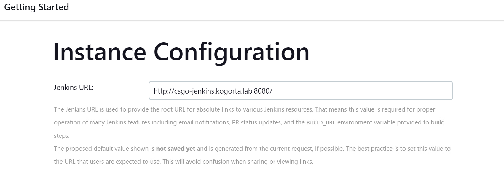
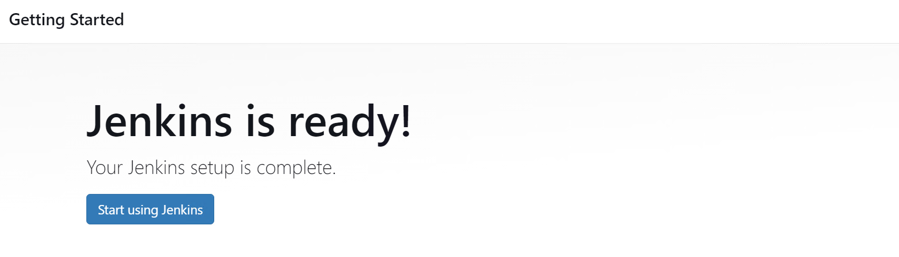
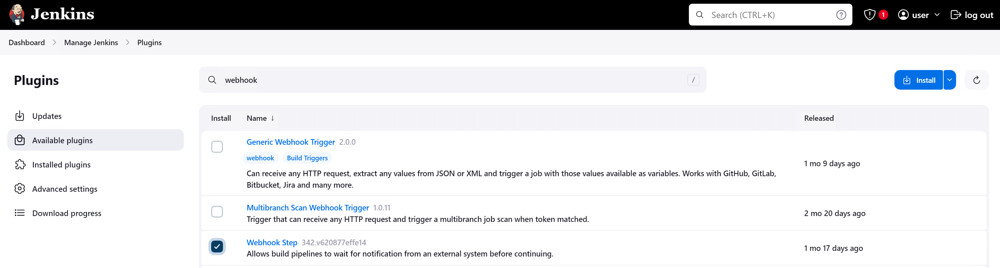
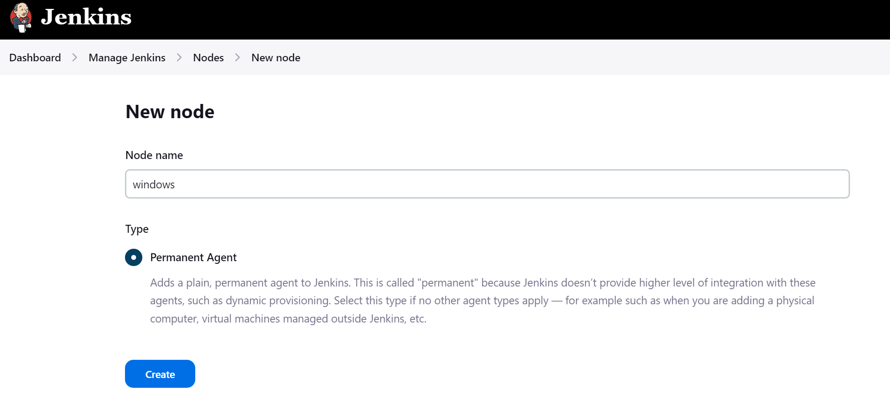
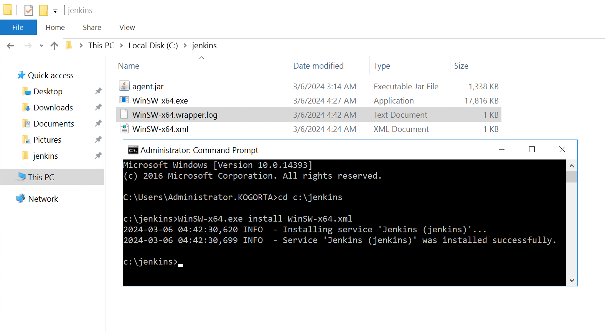

# CSGO: Continues Security and Guided Operations (ru)
Проект посвящен концепции обеспечения непрерывности процессов информационной безопасности Continues Security and Guided Operations (CSGO). Её суть заключается в том, что на любую детектирующую логику должен быть написан соответствующий тест и этот тест должен выполнятся регулярно и как можно чаще.


Сейчас за основу взяты следующие компоненты:
1. Проект Atomic Red Team (далее ART). Библиотека тестов, которую можно расширять своими сценариями.
2. Jenkins в качестве оркестратора, который запускает тесты и анализирует алерты на стороне SIEM.
Почему именно они?
ART:
1. Предлагает структурированную базу тестов в формате YAML, а также модуль PowerShell для парсинга YAML файлов и запуска тестов. Описание тестов в формате YAML удобно и наглядно по сравнению с хранением готовых "сырых" скриптов. Формат YAML универсален и в случае возникновения ограничений текущего модуля для запуска тестов можно будет разработать свой, например на Python, расширив его необходимыми функциональными возможностями.
2. Проект уже включает огромною базу тестов.
Jenkins:
1. Поддержка git. Это позволяет "из коробки" вести удобную разработку тестов, их актуализацию и деплой на защищаемые устройства. В перспективе поддержка git позволит также публиковать и правила корреляции в SIEM, что еще теснее  свяжет совместную разработку тестов и детектирующих логик.
2. Гибкость и универсальность. Можно выполнить любой скрипт, цепочку скриптов. Есть множество плагинов, в том числе поддержка вэбхуков.
3. GUI. Простой графический интерфейс удобен на этапе прототипирования и ускоряет разработку различных сценариев proof of concept.

Выбор данных инструментов не окончательный и будет зависеть от отклика ИБ комьюнити.  
## Демонстрация работы системы на примере KUMA SIEM (Kaspersky)



## Быстрый старт
### Описание демо стенда
### Установка Jenkins (сервер)
Официальная документация по установке Jenkins: https://www.jenkins.io/doc/book/installing/
#### Установка на Ubuntu 22.04 LTS
**Установка Java**
```

sudo apt update
sudo apt install fontconfig openjdk-17-jre
java -version
openjdk version "17.0.10" 2024-01-16
OpenJDK Runtime Environment (build 17.0.10+7-Ubuntu-122.04.1)
OpenJDK 64-Bit Server VM (build 17.0.10+7-Ubuntu-122.04.1, mixed mode, sharing)
```
**Установка Jenkins**
```
sudo wget -O /usr/share/keyrings/jenkins-keyring.asc https://pkg.jenkins.io/debian/jenkins.io-2023.key
echo deb [signed-by=/usr/share/keyrings/jenkins-keyring.asc] https://pkg.jenkins.io/debian binary/ | sudo tee /etc/apt/sources.list.d/jenkins.list > /dev/null
sudo apt-get update
sudo apt-get install jenkins
sudo systemctl enable jenkins
sudo systemctl start jenkins
sudo systemctl status jenkins
jenkins.service - Jenkins Continuous Integration Server
     Loaded: loaded (/lib/systemd/system/jenkins.service; enabled; vendor preset: enabled)
     Active: active (running) since Wed 2024-03-06 09:15:14 UTC; 50s ago
```
Получить пароль по умолчанию
```
cat /var/lib/jenkins/secrets/initialAdminPassword
```
Перейти в веб-консоль Jenkins http://<jenkin-address>:8080/, используя пароль по умолчанию


Установить рекомендуемые плагины


Создать учётную запись администратора


Задать адрес сервера Jenkins


Готово


### Настройка Jenkins (сервер)
Перейти в раздел
**Manage Jenkins -> Plugins -> Availavble plugins**

Установить плагин **Webhook Step**


### Установка Jenkins (агент)
#### Подготовка конфигурации  агента на Jenkins сервере
Перейти в раздел
**Manage Jenkins -> Nodes ->New Node**
Задать имя агента и создать его. В конфигурации достаточно указать label: windows-agent. Остальное можно оставить по умолчанию.


Перейти в раздел конфигурации агента и сохранить команду запуска агента **Manage Jenkins -> Nodes ->windows**

#### Установка на Windows Server 2016
**Установка Java**
Скачать инсталлятор Java 17 для Windows и выполнить стандартные шаги установки.
https://download.oracle.com/java/17/archive/jdk-17.0.10_windows-x64_bin.exe

Создать директорию
С:\jenkins

Любым удобным способом загрузить дистрибутив агента Jenkins (например с помощью браузера: http://jenkin-address:8080/jnlpJars/agent.jar) и сохранить его в C:\jenkins

Для установки агента Jenkins в качестве службы Windiows предлагается использовать проект  Windows Service Wrapper https://github.com/winsw/winsw
Чтобы установить агент Jenkins в качестве службы, необходимо
1. Скачать и сохранить исполняемый файл WinSW.exe (https://github.com/winsw/winsw/releases) в C:\jenkins
2. Скачать пример файла конфигурации WinSW.xml, сохранить  в C:\jenkins и отредактировать. В аргументах указать команду запуска агента, сохраненную ранее.
3. Выполнить установку агента Jenkins в качестве сервиса
```
c:\jenkins>WinSW-x64.exe install WinSW-x64.xml
2024-03-06 04:42:30,620 INFO  - Installing service 'Jenkins (jenkins)'...
2024-03-06 04:42:30,699 INFO  - Service 'Jenkins (jenkins)' was installed successfully.
```


### Подготовка Windows сервера для запуска тестов
## Скоро
Скоро в репозитории появятся примеры тестов и инструкции по настройке системы.
## История
27.02.2024 Презентация концепции на KUMA Meetup