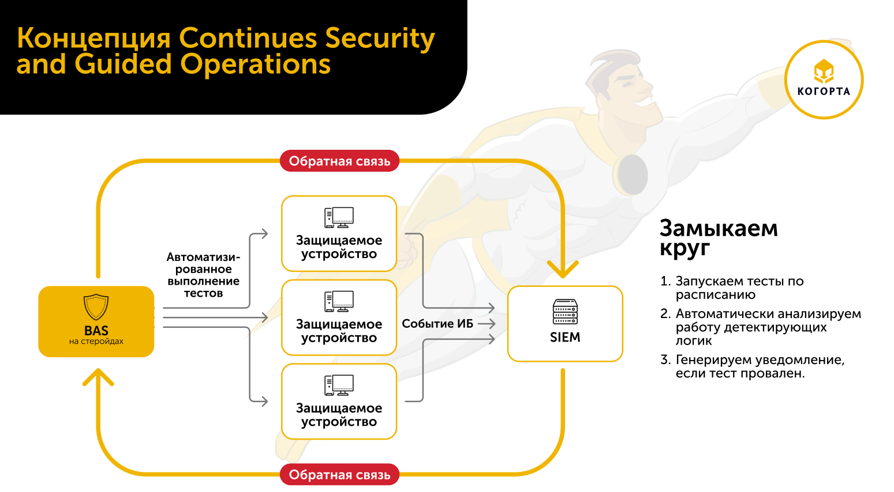
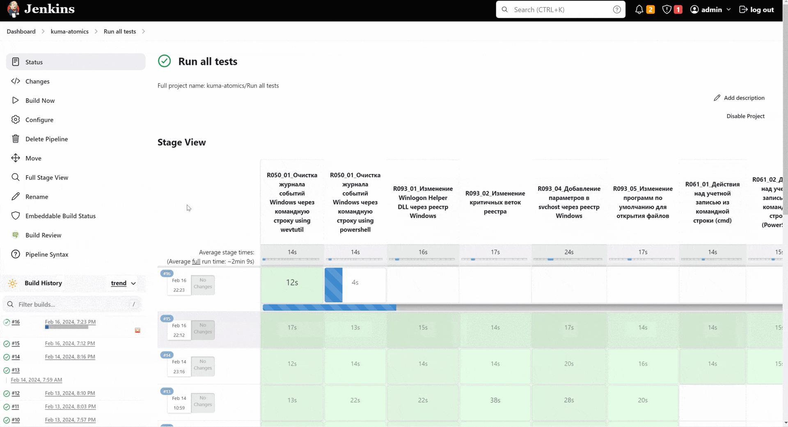

# CSGO: Continues Security and Guided Operations (ru)
Проект посвящен концепции обеспечения непрерывности процессов информационной безопасности Continues Security and Guided Operations. Её суть заключается в том, что на любую детектирующую логику должен быть написан соответствующий тест и этот тест должен выполнятся регулярно и как можно чаще.

За основу взяты следующие компоненты:
1. Проект Atomic Red Team. Библиотека тестов, которую можно расширять своими сценариями.
2. Jenkins в качестве оркестратора, который запускает тесты и анализирует алерты на стороне SIEM.
## Демонстрация работы системы на примере KUMA SIEM (Kaspersky)

## Скоро
Скоро в репозитории появятся примеры тестов и инструкции по настройке системы.
## История
27.02.2024 Презентация концепции на KUMA Meetup