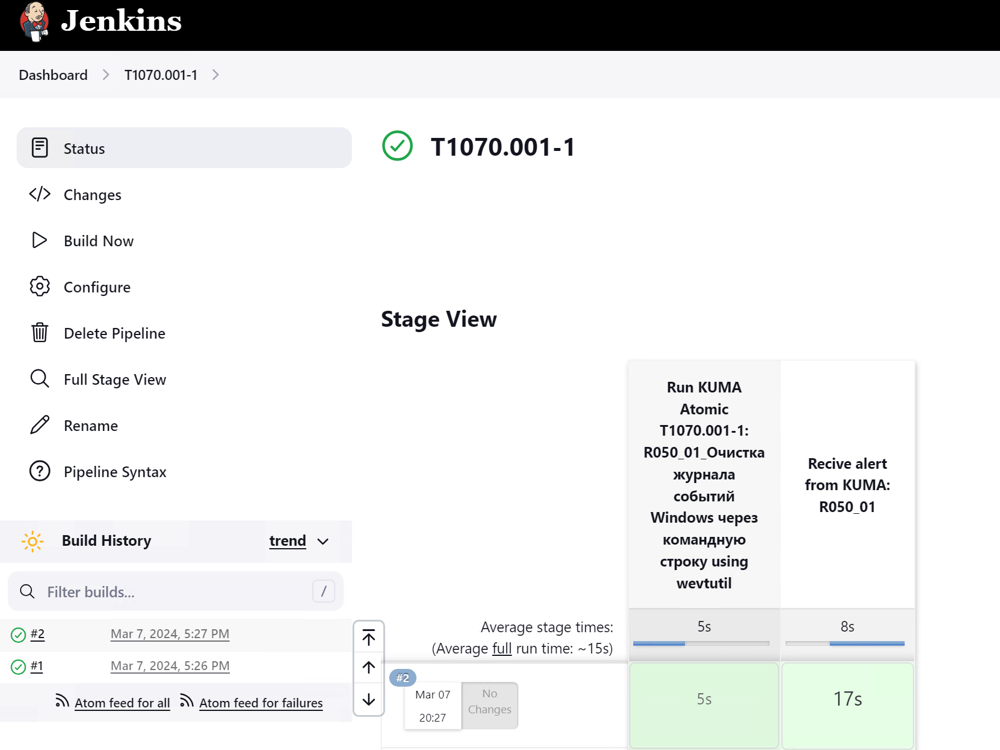

## CSGO: KUMA demo
В разделе описан сценарий автоматизированного и централизованного запуска теста из библиотеки KUMA atomics с последующим анализом результатов работы детектирующей логики SIEM KUMA.
#### Создание задачи Jenkins
Перейти в раздел **Dashboard -> New Item** и создать новую сущность:
- имя: T1070.001-1;
- тип: Pipeline;
В секции **Pipeline** добавить следующий скрипт и сохранить:
```
pipeline {
    agent {label 'windows'}

    stages {
        stage('Run KUMA Atomic T1070.001-1: R050_01_Очистка журнала событий Windows через командную строку using wevtutil') {
            steps {
                powershell '''
					Invoke-AtomicTest T1070.001 -PathToAtomicsFolder "C:\\kuma-atomics" -TestNumbers 1
					'''
            }
        }
        stage('Recive alert from KUMA: R050_01'){
            options {
                timeout(time: 1, unit: "MINUTES")
            }
            steps {
                script {
                    hook = registerWebhook(token: "webhook")
                    callbackURL = hook.url
                    data = waitForWebhook hook
                }
            }
        }
    }
}
```
#### Запуск задачи Jenkins
Перейти в раздел **Dashboard -> T1070.001-1** и выполнить сборку:
- **Build Now**
#### Результат
В ходе выполнения задачи будут выполнены следующие шаги:
- запуск теста T1070.001 из директории C:\\kuma-atomics;
- поднятие вэбхука на http://jenlins-server:8080/webhook-step/webhook
- ожидание генерации события Windows в локальном журнале, отправка события на коллектор KUMA, сработка правила KUMA R050_01;
- сработка правила реагирования и запуск скрипта csgo-responder.sh;
- отправка POST запроса на вебхук.


