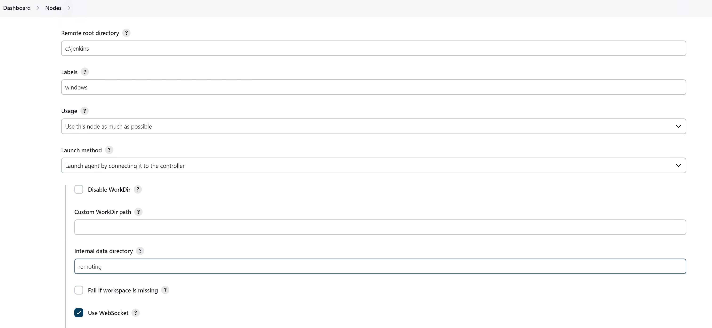

## Установка и настройка Jenkins
В разделе описана пошаговая инструкция по установке и первоначальной настройке Jenkins сервера и Jenkins агента. В результате настройки вы сможете отправлять команды на хост с установленным агентом и получать результаты их выполнения.
#### Установка Jenkins (сервер)
Официальная документация по установке Jenkins: https://www.jenkins.io/doc/book/installing/
#### Установка на Ubuntu 22.04 LTS
**Установка Java**
```

sudo apt update
sudo apt install fontconfig openjdk-17-jre
java -version
openjdk version "17.0.10" 2024-01-16
OpenJDK Runtime Environment (build 17.0.10+7-Ubuntu-122.04.1)
OpenJDK 64-Bit Server VM (build 17.0.10+7-Ubuntu-122.04.1, mixed mode, sharing)
```
**Установка Jenkins**
```
sudo wget -O /usr/share/keyrings/jenkins-keyring.asc https://pkg.jenkins.io/debian/jenkins.io-2023.key
echo deb [signed-by=/usr/share/keyrings/jenkins-keyring.asc] https://pkg.jenkins.io/debian binary/ | sudo tee /etc/apt/sources.list.d/jenkins.list > /dev/null
sudo apt-get update
sudo apt-get install jenkins=2.426
sudo systemctl start jenkins
sudo systemctl status jenkins
sudo systemctl enable jenkins

jenkins.service - Jenkins Continuous Integration Server
     Loaded: loaded (/lib/systemd/system/jenkins.service; enabled; vendor preset: enabled)
     Active: active (running) since Wed 2024-03-06 09:15:14 UTC; 50s ago
```
Получить пароль по умолчанию
```
cat /var/lib/jenkins/secrets/initialAdminPassword
```
Перейти в веб-консоль Jenkins http://your-jenkins-server:8080/, используя пароль по умолчанию


Установить рекомендуемые плагины


Создать учётную запись администратора


Задать адрес сервера Jenkins


Готово

 
#### Настройка Jenkins (сервер)
Перейти в раздел
**Dashboard -> Manage Jenkins -> Plugins -> Availavble plugins**

Установить плагин **Webhook Step**


#### Установка Jenkins (агент)
#### Подготовка конфигурации  агента на Jenkins сервере
Перейти в раздел
**Dashboard -> Manage Jenkins -> Nodes -> New Node**

В конфигурации указать
Name: csgo-windows-server
Remote root directory: C:\jenkins
Labels: windows
Launch method: Launch agent by connecting it to the controller, Use WebSocket

Сохранить.

Перейти в раздел конфигурации агента **Manage Jenkins -> Nodes -> csgo-windows-server** и сохранить команду запуска агента, она понадобится позднее.


#### Установка на Windows Server 2016
**Установка Java**
Скачать инсталлятор [Java 17](https://download.oracle.com/java/17/archive/jdk-17.0.10_windows-x64_bin.exe) для Windows и выполнить стандартные шаги установки.


Создать директорию
С:\jenkins

Любым удобным способом загрузить дистрибутив агента Jenkins (например с помощью браузера: http://jenkins-address:8080/jnlpJars/agent.jar) и сохранить его в C:\jenkins

Для установки агента Jenkins в качестве службы Windiows предлагается использовать проект  [Windows Service Wrapper](https://github.com/winsw/winsw)
Чтобы установить агент Jenkins в качестве службы, необходимо:
1. Скачать и сохранить исполняемый файл [WinSW.exe](https://github.com/winsw/winsw/releases) в C:\jenkins
2. Скачать пример файла конфигурации [WinSW-x64.xml](winsw-example/WinSW-x64.xml), сохранить  в C:\jenkins и отредактировать. В аргументах указать команду запуска агента, сохраненную ранее.
3. Выполнить установку агента Jenkins в качестве сервиса:
```
c:\jenkins>WinSW-x64.exe install WinSW-x64.xml
2024-03-06 04:42:30,620 INFO  - Installing service 'Jenkins (jenkins)'...
2024-03-06 04:42:30,699 INFO  - Service 'Jenkins (jenkins)' was installed successfully.
```
4. Запустить службу:
```
c:\jenkins>WinSW-x64.exe start WinSW-x64.xml
2024-03-07 13:19:18,044 INFO  - Starting service 'jenkins (jenkins)'...
2024-03-07 13:19:18,857 INFO  - Service 'jenkins (jenkins)' started successfully.
```


Перейти в раздел **Dashboard -> Manage Jenkins -> Nodes** и убедится, что агент подключен

#### Проверка
Создадим простой пайплайн, который будет выполнять команду whoami на Windows агенте.
Для этого нужно:
Перейти в раздел **Dashboard -> New Item** и создать новую сущность:
- имя: whoami;
- тип: Pipeline;


В секции **Pipeline** добавить следующий скрипт и сохранить:
```
pipeline {
    agent {label 'windows'}
    stages {
        stage('whoami') {
            steps {
                bat "whoami"
            }
        }
    }
}
```

Перейти в раздел **Dashboard -> whoami и выполнить сборку:
- **Build Now**


Проверить вывод в консоль

Установка и первоначальная настройка Jenkins сервера и агента завершена.